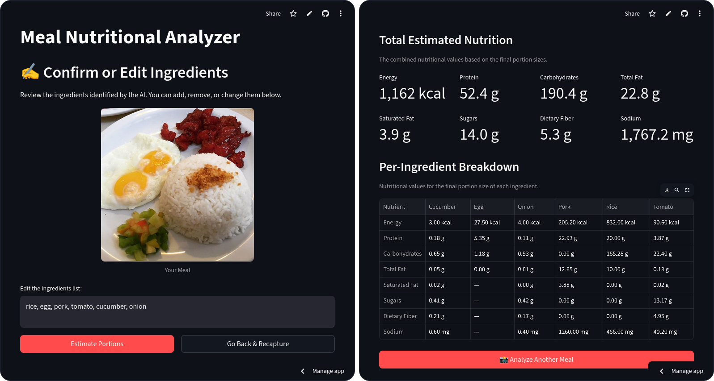
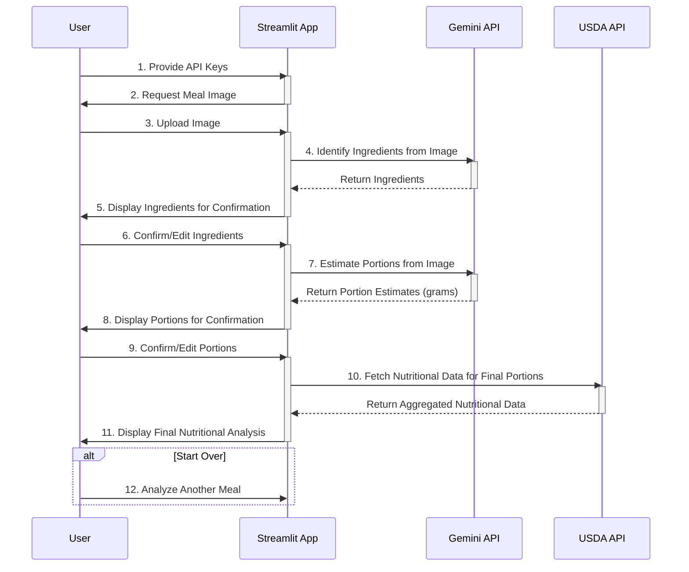

# 🥗 Meal Nutritional Analyzer

This application is a nutritional analyzer that estimates the caloric and macronutrient content of a meal from a single photograph.

It uses the Gemini AI to visually identify food items and estimate their weight, then fetches precise nutritional data for those items from the USDA FoodData Central API. The user is guided through a workflow to capture an image, review and edit the AI-generated food list and portion sizes, and finally view a detailed breakdown of the meal's nutritional value.

